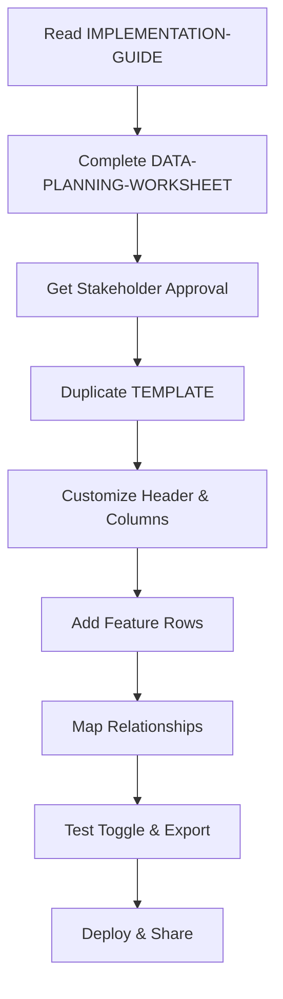
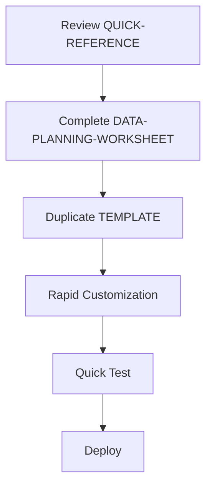
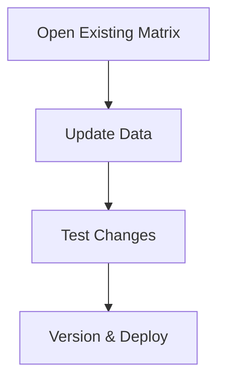

# Vianeo Step 11: Features & Needs Matrix - Complete Skill Package

## Package Overview

This comprehensive skill package enables you to build professional, interactive HTML dashboards for Vianeo Innovation Framework Step 11 (Features & Needs/Feasibility Analysis). Everything you need to create executive-grade deliverables is included.

**What's Included**:
- Complete SKILL.md for Claude to reference
- HTML template with placeholder content
- Standalone CSS file for reference
- Quick reference guide for rapid implementation
- Data planning worksheet for organization
- Comprehensive implementation guide
- Working reference example (your uploaded file)

**Quality Standard**: BCG/McKinsey presentation-grade deliverables

---

## Quick Start (Choose Your Path)

### Path 1: Using Claude (Recommended)
1. Tell Claude: "Build a Step 11 matrix for [project name]"
2. Claude will read SKILL.md and guide you through data collection
3. Claude builds the complete HTML file for you
4. Review, test, and share

**Time**: 15-30 minutes

### Path 2: Manual Build
1. Complete `DATA-PLANNING-WORKSHEET-step11.md`
2. Open `step11-features-needs-TEMPLATE.html` in text editor
3. Follow `IMPLEMENTATION-GUIDE-step11.md` step-by-step
4. Test and deploy

**Time**: 2-3 hours (first time), 30-60 minutes (subsequent)

### Path 3: Quick Reference
1. Already familiar with the format?
2. Open `QUICK-REFERENCE-step11.md`
3. Copy template, customize data, done

**Time**: 10-15 minutes

---

## File Descriptions

### 1. step11-features-needs-SKILL.md
**Purpose**: Primary skill file that Claude reads to understand how to build matrices

**Contains**:
- Complete skill overview and use cases
- Build process (6 phases)
- Data structure requirements
- Technical implementation details
- Troubleshooting guide
- Best practices

**When to use**: Have Claude read this when you request a Step 11 matrix

**Size**: ~17KB

---

### 2. step11-features-needs-TEMPLATE.html
**Purpose**: Clean HTML template with placeholder content ready for customization

**Contains**:
- Complete HTML structure
- Embedded CSS (Vianeo design system)
- Embedded JavaScript (toggle, export, print)
- Example rows showing all timing types
- Placeholder partner and means columns
- Accessibility features (WCAG 2.1 AA)

**How to use**:
1. Duplicate this file
2. Rename: `[project]-features-needs-matrix.html`
3. Update project info, columns, and features
4. Test and deploy

**Key sections to customize**:
- Header title and subtitle
- Statistics
- Column headers (Partners and Means)
- Feature rows with timing badges
- Partner relationships
- Means requirements

**Size**: ~36KB (fully self-contained)

---

### 3. vianeo-step11-matrix-styles.css
**Purpose**: Standalone CSS reference for design system specifications

**Contains**:
- Complete Vianeo design system variables
- All component styles
- Responsive adjustments
- Print optimizations
- Accessibility styles

**When to use**:
- Reference for color values
- Understanding component structure
- Custom styling projects
- Design system documentation

**Note**: The template already has CSS embedded. This is for reference only.

**Size**: ~12KB

---

### 4. QUICK-REFERENCE-step11.md
**Purpose**: Rapid implementation guide with essential information only

**Contains**:
- 5-minute quick start
- Critical rules and requirements
- Color palette (exact hex values)
- Typography scale
- Spacing system
- Common customization points
- Cell type options
- Timing badge formats
- Troubleshooting quick fixes
- Keyboard shortcuts

**When to use**:
- Already built matrices before
- Need quick reminder of syntax
- Looking up specific values (colors, sizes)
- Troubleshooting common issues

**Perfect for**: Experienced users who need reference, not full tutorial

**Size**: ~10KB

---

### 5. DATA-PLANNING-WORKSHEET-step11.md
**Purpose**: Structured worksheet for organizing data before building

**Contains**:
- Project information section
- Features list (12 templates)
- Partner categories definition
- Means categories definition
- Partner relationship mapping table
- Means requirement mapping table
- Statistics calculation
- Implementation notes
- Validation checklist

**When to use**:
- Before building any new matrix
- When gathering data from team
- For stakeholder review and approval
- As planning documentation

**Workflow**:
1. Complete all sections
2. Get stakeholder approval
3. Use data to populate HTML template
4. Keep worksheet for future updates

**Size**: ~17KB

---

### 6. IMPLEMENTATION-GUIDE-step11.md
**Purpose**: Comprehensive step-by-step walkthrough for building matrices

**Contains**:
- Complete introduction to Step 11
- 5-phase implementation process:
  * Phase 1: Planning & Data Collection
  * Phase 2: Setup & Configuration
  * Phase 3: Building the Matrix
  * Phase 4: Testing & Validation
  * Phase 5: Deployment & Sharing
- Advanced customization techniques
- Detailed troubleshooting
- Best practices
- Success checklist

**When to use**:
- First time building a matrix
- Teaching others to build matrices
- Comprehensive reference needed
- Quality assurance checking

**Perfect for**: New users who need detailed guidance

**Size**: ~22KB

---

## Typical Workflow

### Initial Setup (First Matrix)



**Time**: 2-3 hours

### Subsequent Matrices



**Time**: 30-60 minutes

### Updates to Existing Matrix



**Time**: 10-15 minutes

---

## Key Features of Step 11 Matrices

### Dual-View Architecture
- **Partners View**: External dependencies, third-party integrations
- **Means View**: Internal resources, team capacity, budget
- **Toggle Switch**: Seamless transition between views

### Implementation Timeline
- **Already Available**: Green badges (features already built)
- **Short-term**: Blue badges (0-6 months)
- **Mid-term**: Yellow badges (6-12 months)
- **Long-term**: Orange badges (12+ months)

### Opportunity Levels
- **High**: Green row background (top priority)
- **Medium**: Yellow row background (important)
- **Low**: Orange row background (nice to have)
- **Expected**: Blue row background (standard features)
- **Accessory**: Gray row background (optional enhancements)

### Export & Print
- **CSV Export**: Download current view for analysis
- **Professional Print**: Print-optimized for presentations
- **Keyboard Shortcuts**: Ctrl/Cmd + E (export), P (print), T (toggle)

### Accessibility
- **WCAG 2.1 AA Compliant**: Meets international standards
- **Keyboard Navigation**: Full keyboard support
- **Screen Reader**: Announces changes and structure
- **Semantic HTML**: Proper structure for assistive technology

---

## Technical Specifications

### Format
- **File Type**: Single HTML file (self-contained)
- **Size**: Typically 50-100KB
- **Dependencies**: None (fully offline)
- **Browser Support**: Chrome, Firefox, Safari, Edge (modern versions)

### Design System
- **Color Palette**: Vianeo-specified hex values
- **Typography**: Inter font family, 8px-based spacing
- **Layout**: 16:9 landscape, max-width 1600px
- **Responsive**: Adapts to different screen sizes

### Data Capacity
- **Features**: 10-12 recommended (up to 15 supported)
- **Partner Columns**: 5-7 optimal (up to 10 supported)
- **Means Columns**: 7-10 optimal (up to 12 supported)

### Performance
- **Load Time**: Instant (no external resources)
- **Toggle Speed**: <250ms (debounced)
- **Export Speed**: <1 second for typical datasets
- **Memory Usage**: Minimal (~5-10MB browser memory)

---

## Best Practices Summary

### Data Quality
1. Complete planning worksheet before building
2. Get stakeholder approval on data
3. Validate timing assignments with technical leads
4. Confirm partner relationships with business development
5. Review opportunity levels with product management

### Build Quality
1. Start with template, modify incrementally
2. Test toggle after adding each row
3. Verify cell counts match column counts
4. Check browser console for errors
5. Test in multiple browsers before sharing

### Maintenance
1. Update quarterly or after major milestones
2. Save dated backups before changes
3. Document changes in comments
4. Version your files
5. Keep planning worksheet current

### Collaboration
1. Designate single source of truth
2. Clear ownership for updates
3. Review process for changes
4. Feedback loop with users
5. Share both HTML and CSV exports

---

## Common Use Cases

### Strategic Planning
- Map features to implementation timeline
- Identify resource gaps and constraints
- Prioritize based on opportunity levels
- Plan partner engagement strategy

### Stakeholder Communication
- Present feature roadmap visually
- Show external dependencies clearly
- Demonstrate resource requirements
- Support funding requests

### Team Coordination
- Align on feature priorities
- Clarify partner responsibilities
- Document means requirements
- Track implementation progress

### Decision Support
- MVP definition (high opportunity + short-term)
- Resource allocation (means requirements)
- Risk assessment (partner dependencies)
- Timeline planning (timing badges)

---

## Integration with Vianeo Framework

### Upstream Dependencies
- **Step 7: Requesters** → Customer segments inform needs
- **Step 8: Functionalities** → Features derive from requirements
- **Step 9: Solution Definition** → Technical approach informs partners/means

### Downstream Uses
- **Step 12: Features & Means** → Detailed resource planning
- **MVP Definition** → High opportunity features become scope
- **Resource Planning** → Means become budget line items
- **Timeline Development** → Timing badges inform project schedule

### Key Questions Answered
1. Which features address which customer needs?
2. What external partners are required for each feature?
3. What internal resources (means) are needed?
4. What's the implementation timeline?
5. Which features offer highest opportunity?

---

## Support & Resources

### Getting Help

**For Claude Users**:
1. Say: "I need help with my Step 11 matrix"
2. Claude will read SKILL.md and provide guidance
3. Share specific issues for troubleshooting

**For Manual Builders**:
1. Check QUICK-REFERENCE for common solutions
2. Review IMPLEMENTATION-GUIDE troubleshooting section
3. Compare to working reference file
4. Use browser DevTools to inspect elements

### Additional Resources

**In This Package**:
- SKILL.md (complete documentation)
- IMPLEMENTATION-GUIDE (step-by-step walkthrough)
- QUICK-REFERENCE (rapid lookup)
- DATA-PLANNING-WORKSHEET (organization tool)

**Reference Files**:
- Your uploaded working example
- REBUILD-GUIDE (from your uploads)

**External Resources**:
- Vianeo Innovation Framework documentation
- Browser developer tools guides
- Accessibility testing tools (WAVE, axe)

---

## Version History

### Version 1.0 (Current)
- Initial skill package release
- Complete SKILL.md documentation
- HTML template with dual-view toggle
- Standalone CSS reference
- Quick reference guide
- Data planning worksheet
- Comprehensive implementation guide
- Based on Marine Data Analytics Platform example

### Future Enhancements
- Additional example matrices (education, healthcare)
- Video tutorial links
- Interactive data entry wizard
- Template variations for different industries

---

## Success Metrics

You're successfully using this skill package when:

1. **Speed**: Building new matrices in 30-60 minutes
2. **Quality**: Deliverables meet BCG/McKinsey standards
3. **Consistency**: All team matrices use same format
4. **Adoption**: Stakeholders reference matrices regularly
5. **Impact**: Matrices inform planning and decision-making

---

## Quick Tips

### For First-Time Users
- Start with IMPLEMENTATION-GUIDE
- Complete DATA-PLANNING-WORKSHEET first
- Don't skip stakeholder validation
- Test thoroughly before sharing
- Get feedback and iterate

### For Experienced Users
- Use QUICK-REFERENCE for lookups
- Keep TEMPLATE handy for new projects
- Version your files consistently
- Update matrices quarterly
- Share best practices with team

### For Claude Integration
- Have Claude read SKILL.md first
- Provide complete feature data upfront
- Review Claude's output before sharing
- Ask for specific customizations
- Use Claude for rapid iterations

---

## File Naming Convention

### For Your Matrices
```
[project-name]-features-needs-matrix.html
[project-name]-features-needs-matrix-v[X.X].html
[project-name]-features-needs-matrix-YYYY-MM-DD.html
```

### Examples
```
marine-data-features-needs-matrix.html
healthcare-records-features-needs-matrix-v1.2.html
education-platform-features-needs-matrix-2025-01-15.html
```

---

## Final Checklist

Before using this skill package, ensure you have:

- [ ] All 6 core files in your outputs folder
- [ ] Text editor for HTML editing
- [ ] Modern web browser for testing
- [ ] Project data ready (features, partners, means)
- [ ] Stakeholder availability for validation
- [ ] Understanding of Vianeo Framework Step 11

Before delivering a matrix, ensure:

- [ ] All data validated with stakeholders
- [ ] Toggle switches views smoothly
- [ ] CSV export works for both views
- [ ] Print preview looks professional
- [ ] No browser console errors
- [ ] Tested in multiple browsers
- [ ] File properly named and versioned
- [ ] Backup created of previous version

---

## What's Next?

### Immediate Actions
1. Review this README completely
2. Choose your implementation path
3. Start with DATA-PLANNING-WORKSHEET
4. Build your first matrix
5. Get feedback and iterate

### Long-Term Goals
1. Build matrices for all major projects
2. Establish quarterly update cadence
3. Train team members on process
4. Integrate into planning cycles
5. Share best practices across organization

### Advanced Usage
1. Customize color schemes for brand alignment
2. Create industry-specific templates
3. Develop data integration workflows
4. Build presentation decks around matrices
5. Link matrices to project management tools

---

**You now have everything needed to build professional Step 11 Features & Needs matrices. Choose your path and get started!**

---

## Package Contents Summary

```
📦 step11-features-needs-skill-package/
│
├── 📄 README.md (this file)
│   Complete package overview and quick start guide
│
├── 📄 step11-features-needs-SKILL.md (17KB)
│   Primary skill documentation for Claude
│
├── 📄 step11-features-needs-TEMPLATE.html (36KB)
│   Clean HTML template ready for customization
│
├── 📄 vianeo-step11-matrix-styles.css (12KB)
│   Standalone CSS reference for design system
│
├── 📄 QUICK-REFERENCE-step11.md (10KB)
│   Rapid implementation guide
│
├── 📄 DATA-PLANNING-WORKSHEET-step11.md (17KB)
│   Structured data organization tool
│
└── 📄 IMPLEMENTATION-GUIDE-step11.md (22KB)
    Comprehensive step-by-step walkthrough

Total Package Size: ~114KB
All files text-based, portable, version-controllable
```

---

**Questions? Issues? Ideas?** This is a living skill package. Use it, refine it, share it with your team.

**Success is measured by**: Professional deliverables that inform decision-making and drive project success.

**Get started now**: Open DATA-PLANNING-WORKSHEET-step11.md and begin organizing your data.
